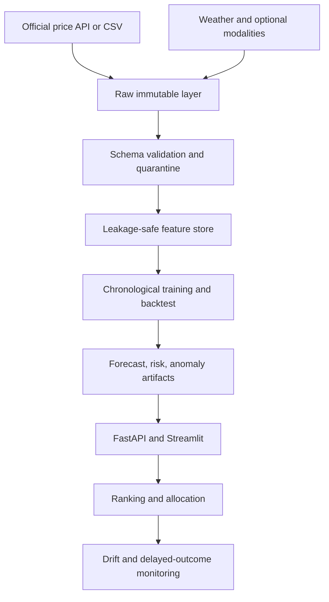

# AgriDecision OS India

**A reproducible agricultural price-forecasting, risk-detection, and decision-intelligence platform for Indian wholesale markets.**

[](https://github.com/ashutoshmahanta714-bit/agridecision-os-india/actions/workflows/ci.yml)
[](https://www.python.org/)
[](LICENSE)

> **Integrity note:** the repository includes synthetic data only to verify that the software runs. Synthetic metrics are automatically labelled and must never be presented as real-world model performance. Train and evaluate on the official historical data before publishing performance claims.

## Problem statement

Agricultural prices differ across mandis and can change sharply. A farmer, trader, analyst, or policymaker needs more than a chart of yesterday's values. The first production problem is:

> Using information available up to today, predict the modal wholesale onion price at each selected Indian mandi exactly seven calendar days ahead, estimate the probability of a price increase of at least 15%, flag unusual observations, and rank destination markets after transport cost and risk.

The system is designed to extend to tomato and potato and to 14- and 30-day horizons only after the seven-day onion pipeline is validated.

## What the system returns

| Output | Meaning |
|---|---|
| `predicted_price` | Seven-day modal price forecast in INR per quintal |
| `prediction_lower_90`, `prediction_upper_90` | Split-conformal uncertainty interval |
| `shock_probability` | Estimated probability of a price rise of at least 15% |
| `anomaly_score` | Unsupervised score for unusual market observations |
| `recommendation_rank` | Risk- and cost-aware market rank |
| `allocated_quantity` | Constrained quantity allocation across selected markets |

## System architecture



## Current implementation status

| Capability | Status | Evidence |
|---|---|---|
| API ingestion | Implemented | Pagination, retries, rate-limit backoff, checkpoints, resume |
| CSV fallback | Implemented | CSV/ZIP loader with encoding handling |
| Data quality | Implemented | Schema coercion, logical rules, duplicates, quarantine report |
| Forecasting | Implemented | Seasonal baseline + gradient-boosted regression |
| Price-shock classification | Implemented | Class weighting and validation-selected threshold |
| Anomaly detection | Implemented | Isolation Forest |
| Uncertainty | Implemented | Split-conformal 90% intervals |
| Evaluation | Implemented | Chronological holdout, MASE, PR-AUC, calibration, market slices |
| Decision intelligence | Implemented | Transparent ranking and constrained allocation |
| API/dashboard | Implemented | FastAPI endpoints and Streamlit backtest dashboard |
| Monitoring | Implemented | PSI, KS drift checks, delayed-outcome evaluation |
| Advanced laboratories | Implemented | Statistics, clustering, NLP, CV, satellite, causal, graph, survival, simulation |
| Real-data performance | **Not yet claimed** | Requires stable API or official CSV download and a documented data snapshot |

## Quick start: reproducible demo

```bash
git clone https://github.com/ashutoshmahanta714-bit/agridecision-os-india.git
cd agridecision-os-india
python -m pip install -e ".[dev,app]"
python -m agridecision.cli demo --output-dir artifacts
python -m pytest
```

Launch the interfaces:

```bash
streamlit run dashboard/app.py
uvicorn agridecision.api.app:app --reload --port 8000
```

Interactive API documentation is then available at `http://127.0.0.1:8000/docs`.

## Use official data

The primary price source is the Data.gov.in resource **Current Daily Price of Various Commodities from Various Markets (Mandi)**, resource ID `9ef84268-d588-465a-a308-a864a43d0070`.

### Option A: resilient API downloader

Store the key in `DATA_GOV_API_KEY`; never put it in code or GitHub.

```bash
python -m agridecision.cli download \
  --commodity Onion \
  --output data/raw/mandi_prices.csv
```

The downloader uses small pages, exponential retry, `Retry-After`, a delay between pages, and resumable checkpoints. If the government API is unavailable, stop rather than repeatedly increasing load.

### Option B: official CSV/ZIP fallback

Download the same resource through the portal, place it in `data/raw/`, and run:

```bash
python -m agridecision.cli prepare \
  --input data/raw/downloaded_file.csv \
  --output-dir data/processed

python -m agridecision.cli train \
  --input data/processed/supervised_features.csv \
  --output-dir artifacts
```

Raw data, secrets, trained models, and generated results are excluded from Git by default.

## Evaluation rules

- Split by time, never randomly, because production predicts the future.
- Join targets by exact calendar date; seven observations are not automatically seven days.
- Shift all rolling statistics so they cannot see today's/future values.
- Compare the ML model against seasonal-naive forecasting.
- Report MAE, RMSE, MAPE, MASE, PR-AUC, recall, F1, Brier score, and interval coverage.
- Check performance separately by market.
- Do not tune a decision threshold on the final test period.
- Keep synthetic, validation, and final real-data results clearly separated.

## Repository map

```text
src/agridecision/
├── data/          # API/CSV ingestion, schema, quality, weather, SQLite
├── features/      # calendar, lag, rolling, target, and geospatial features
├── models/        # forecast, risk, anomaly, uncertainty, saved bundle
├── evaluation/    # temporal splits, metrics, market slices
├── advanced/      # statistics, NLP, CV, satellite, causal, graph, survival, simulation
├── decision/      # ranking and constrained allocation
├── monitoring/    # drift and delayed outcome checks
└── api/           # production inference endpoints
```

Use [docs/LEARNING_AND_REVIEW_GUIDE.md](docs/LEARNING_AND_REVIEW_GUIDE.md) to review the project in the correct order. The advanced modules are research extensions; they should be connected to real sources only after the core price pipeline passes its data and baseline gates.

## What makes this portfolio project credible

The differentiator is not the number of algorithms. It is the complete reasoning chain: a public-impact problem, resilient ingestion, auditable rejected records, leakage control, time-aware evaluation, baselines, uncertainty, probabilistic decisions, monitoring, tests, and honest limitations.

## Responsible-use boundary

This is a decision-support research project, not financial advice or a guaranteed trading system. Predictions may be wrong during policy changes, extreme weather, missing reporting, market closures, or structural shifts. See [docs/ETHICS_AND_LIMITATIONS.md](docs/ETHICS_AND_LIMITATIONS.md).

## License

[MIT](LICENSE). Official source data remains governed by its source licence and attribution requirements.

