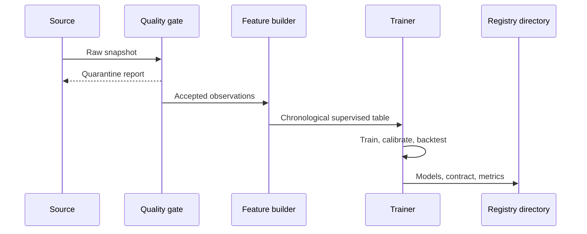

# Architecture and data lifecycle

## Layers

1. **Raw:** immutable API pages or portal files plus retrieval metadata.
2. **Interim:** canonical names/types without silent deletion.
3. **Validated:** accepted observations and a separate quarantine table.
4. **Feature:** prediction-time-safe features and exact-date targets.
5. **Artifact:** models, feature contract, metrics, predictions, and provenance.
6. **Serving:** inference API, decision API, and dashboard.
7. **Monitoring:** feature drift and delayed realised outcomes.

## Training event sequence

## Production prediction lifecycle

The model contract lists every required categorical, numeric, and anomaly feature. The API rejects incomplete inputs. It never fills unavailable business values with invented numbers. Predictions are logged with a target date; after that date, realised values can be joined for monitoring.

## Failure behaviour

- API timeouts trigger bounded exponential retry.
- HTTP 429 respects `Retry-After` and delays future pages.
- Partial downloads retain a checkpoint and can resume.
- Official CSV/ZIP is the supported fallback.
- Invalid rows move to quarantine with reasons.
- Missing artifacts make the API report `not_ready`.
- Missing dashboard artifacts produce an instruction, not an empty chart.

